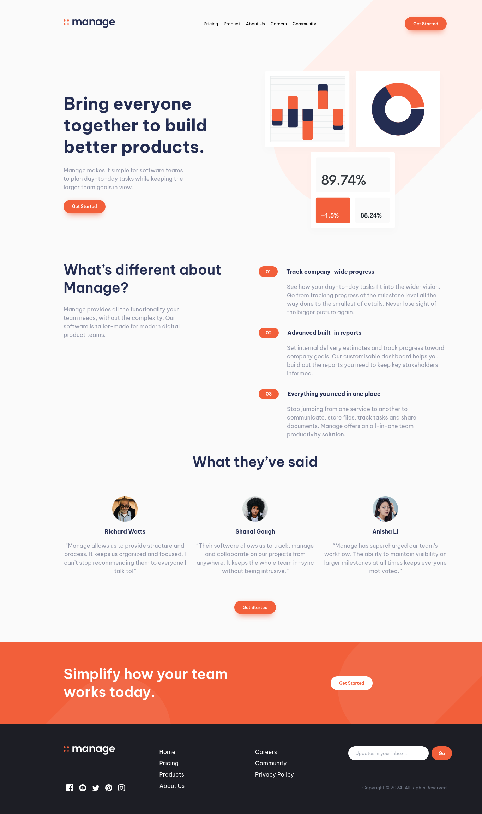

# Frontend Mentor - Manage landing page solution

This is a solution to the [Manage landing page challenge on Frontend Mentor](https://www.frontendmentor.io/challenges/manage-landing-page-SLXqC6P5). Frontend Mentor challenges help you improve your coding skills by building realistic projects. 

## Table of contents

- [Overview](#overview)
  - [Screenshot](#screenshot)
  - [Links](#links)
- [My process](#my-process)
  - [Built with](#built-with)
  - [Useful resources](#useful-resources)
- [Author](#author)

## Overview

### Screenshot

### Links

- Solution URL: [Github Source Code](https://github.com/Miguelpr123/frontendmentor/tree/master/manage-landing-page)
- Live Site URL: [Live site URL here](https://miguelpr123.github.io/frontendmentor/manage-landing-page)

## My process

### Built with

- Semantic HTML5 markup
- CSS custom properties
- Flexbox
- CSS Grid
- Mobile-first workflow
- [TailwindCSS](https://tailwindcss.com/) - TailwindCSS library - v3.4.10

### Useful resources

- [Introduction · TailwindCSS v3.4.10](https://tailwindcss.com/docs/installation) - TailwindCSS documentation

## Author

- Github - [Miguel Pérez Rodríguez](https://github.com/Miguelpr123)
- Frontend Mentor - [@Miguelpr123](https://www.frontendmentor.io/profile/Miguelpr123)
- Instagram - [@miguelperezrodriguez45](https://instagram.com/miguelperezrodriguez45)